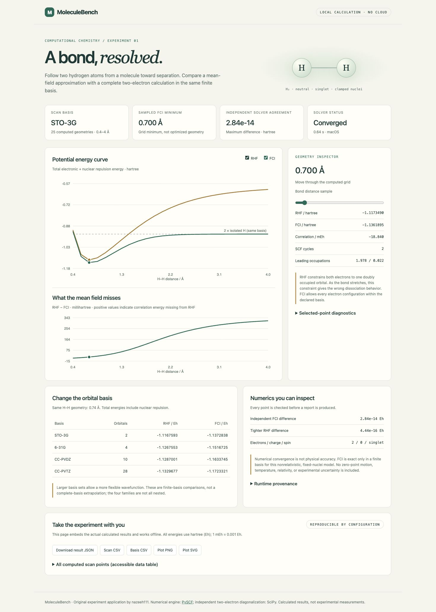

# MoleculeBench

**An H–H bond laboratory with calculations you can reproduce and checks you can inspect.**

MoleculeBench compares restricted Hartree–Fock (RHF), a single-determinant mean-field approximation, with full configuration interaction (FCI), an all-configurations solution in a finite orbital basis. It scans the H₂ bond, compares four basis sets, and independently constructs and diagonalizes the two-electron Hamiltonian to check the FCI calculation.

The dashboard runs offline and displays actual computed data. Its geometry selector shows the energies, natural orbital occupations and convergence diagnostics at each sampled distance. Downloadable JSON, CSV, PNG and SVG artifacts accompany every report.

**Development history:** Developed locally using Git before publication. Publication dates describe repository availability, not a backdated development timeline.



## Run locally

Python 3.11–3.13 is supported; Python 3.13 on macOS arm64 was tested locally. Linux/macOS CPU wheels for the scientific dependencies are needed. No account, API key, paid hardware or internet connection is required after installation.

```sh
python3 -m venv .venv
. .venv/bin/activate
python -m pip install '.[dev]'
moleculebench config > config.json
moleculebench run --config config.json --output runs/hydrogen
```

Open `runs/hydrogen/index.html` directly in a browser. No web server or CDN is needed. Use a new output directory for each experiment; existing directories are refused to preserve earlier results. JSON configuration accepts only the documented fields and finite, bounded values. Files are limited to 16 KiB; duplicate fields and excessive nesting are rejected.

A [live example report](https://nazeeh111.github.io/MoleculeBench/), precomputed [offline report](docs/demo/index.html), [raw results](docs/demo/results.json) and [energy plot](docs/demo/energy-curves.png) are included. The report can be downloaded with its neighboring CSV/plot files and opened offline.

```json
{
  "start_angstrom": 0.4,
  "stop_angstrom": 4.0,
  "points": 25,
  "scan_basis": "sto-3g",
  "comparison_angstrom": 0.74,
  "tolerance": 1e-10
}
```

The scan supports STO-3G, 6-31G and cc-pVDZ, 3–81 points, and 0.3–6 Å. At one independently specified geometry it compares STO-3G, 6-31G, cc-pVDZ and cc-pVTZ. Restricting the system to two electrons and these basis sizes keeps the independent dense calculation small; this is not a general large-molecule FCI interface. Numerical thread pools are limited to one during each calculation.

## What the experiment shows

- **Correlation:** the difference between FCI and RHF in the same basis. On stretching H₂, the two leading natural orbital occupations approach one each, while RHF retains a doubly occupied orbital.
- **Dissociation:** the energy reference is twice a separately calculated isolated hydrogen atom in the same atomic basis. The finite-distance curve need not equal that limit. No counterpoise correction for basis-set superposition error is applied.
- **Basis sensitivity:** larger orbital bases change both RHF and FCI energies. This is a comparison, not a complete-basis extrapolation; these four basis families are not all nested.
- **Numerical sensitivity:** RHF is solved again with a tighter energy threshold, and PySCF FCI is checked against a separately assembled matrix. Small discrepancies quantify numerical agreement, not physical uncertainty.

The minimum shown is the lowest **sampled** energy. It is not an optimized equilibrium geometry, fitted spectroscopy result or experimental bond length. An energy tolerance is not an error bar.

## Scientific contract

Fixed neutral H₂, two electrons, singlet, nonrelativistic Born–Oppenheimer model with clamped nuclei. Coordinates are in angstrom; energies are in hartree and include nuclear repulsion. No nuclear motion, zero-point energy, finite temperature, relativistic effects, solvent or experimental data is modeled. FCI is exact only within the finite basis and solver tolerance. RHF convergence establishes a stationary solution within its restricted ansatz, not stability against unrestricted orbital changes.

Every point requires SCF and FCI convergence, electron-count and natural-occupation bounds, singlet spin, a small SCF commutator, a small independent eigenvector residual, FCI energy no higher than RHF, independent FCI agreement, and tighter-threshold agreement. A failed check stops report generation. Runtime exceptions return CLI exit code 2, not a successful calculation with silently invalid results.

The independent check shares PySCF integrals. It verifies the many-electron assembly and solver using a different numerical route; it does **not** independently validate integral generation or the basis data. See [physics and equations](docs/physics.md), [architecture](docs/design.md) and [verification](docs/verification.md).

## Test and package

```sh
python -m pytest -q
python -m build
python -m pip check
```

Tests include the analytic noninteracting two-electron spectrum, fixed STO-3G regression values, the separated-atom limit, unit consistency, variational ordering, nonconvergence rejection, invalid configuration and CLI inputs, artifact generation, and preservation of existing outputs. CI is configured for Python 3.11 and 3.13; local evidence and untested limits are recorded separately.

Original application code: MIT, copyright nazeeh111. PySCF and scientific-library rights remain with their owners. See [dependency notices](THIRD_PARTY_NOTICES.md).
